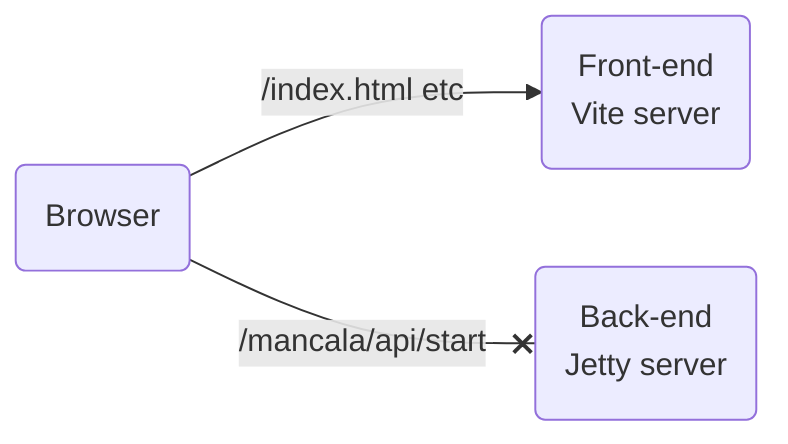
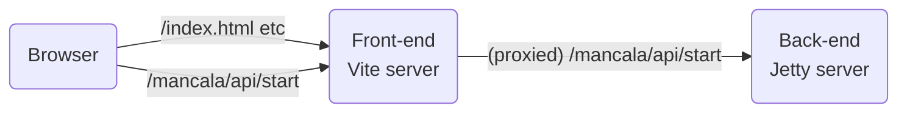

# Mancala

IMPORTANT NOTE:
Make sure you use java version 11 or higher!

This repository contains the files for three modules:
- Object orientated programming: make your own implementation of the mancala game.
- Model view controller: build a website for your own mancala game (or use the sloppy default implementation).
- CI/CD: run your tests automatically when pushing code to Gitlab.


## Repository structure

In this repository, we find the following files and directories.

```
api
   *Java subproject for running the webserver*
client
   *Our front-end*
domain
   *Java subproject for the Mancala domain*
persistence
   *Java subproject for interacting with the database*
.gitignore
README.md
settings.gradle
...
```

## The back-end

The back-end is a Java API, which is served using a simple [Jetty server](https://en.wikipedia.org/wiki/Jetty_(web_server)). We can build, test and run the whole project using the gradle wrapper:

```bash
# Build the project
./gradlew build
# Run all unit tests
./gradlew test
# Run the Jetty server
./gradlew run
```

If you run the server, you will see that it listens at `http://localhost:8080`.

## The front-end

The front-end (found in the `client` folder) is a [React](https://react.dev/) project, which is served using [Vite](https://vitejs.dev/). Here we find the following files:

```
public
   *static files such as images*
src
   *The React source code*
package.json
README.md
vite.config.ts
...
```

Styling can be done using [tailwindcss](https://tailwindcss.com/). As you may remember from the Front-End module, [`package.json`](./client/package.json) contains the dependencies of the project. Before we can run it, we need to install the dependencies:

```bash
cd client
npm install
```

After that, we can use the scripts from `package.json` to do the following:

```bash
# Start the front-end server
npm run dev
# Check code for common mistakes and style conventions
npm run lint
# Create a production-worthy build of the client
npm run build
```

If you start the front-end server, you will see that it listens at `http://localhost:5173`. Navigate to this url in your favorite browser, and admire the Mancala website! If you save changes to any of the React files, the front-end server will immediately inform the browser of these changes, and you will see them on your screen immediately.

## Two servers?

As we see, the project consists of two servers. Thus, to run the application you need to have both servers running at the same time. This probably means you'll need to open two different terminals/command prompts to do so.

The front-end server is mainly for development purposes, because it makes sure that any changes in the client code are immediately reflected in the browser. Our mancala logic, on the other hand, resides in the back-end server. So, if we want to start a new mancala game, we need to fetch `/mancala/api/start` from the back-end server. However, [cross-origin resource shenanigans (CORS)](https://developer.mozilla.org/en-US/docs/Web/HTTP/CORS) prevent us from doing this directly.



Instead, we send _all_ fetch calls to the front-end server. The vite server is [configured](./client/vite.config.ts) to proxy any path starting with `/mancala` to the back-end server:



Since the front-end server is mainly for development purposes, it is usually not deployed to a production environment. Instead, a build of the client (see above) is hosted statically on the back-end server.

## Assignment

This assignment follows the [MVC lecture](https://drive.google.com/drive/u/0/folders/1PvC-HS8ty3mdtSaNdR5rt5-GwL-5_LaY). The overall goal is to integrate your mancala domain into a full stack application, following the (web-)MVC architecture.

### Part 0: reconnaissance

While you were modeling and implementing the mancala domain, your team mates implemented the API layer. Even though this layer depends on the domain and persistence layers (which haven't been built yet), they were able to design the API layer by defining contracts between the layers. Thus, you will see that the domain and persistence projects are not empty.

After finishing the API layer, your team mates started working on the client, but they haven't finished it yet.

Have a look at the ground work provided in this repository, and try to make a sketch of the architecture. How do the layers depend on each other? And when the application runs and the game is played, how does information flow through the system?

### Part 1: the domain

It's time to connect your work with the work done in the API layer. Copy the files from your own mancala implementation into the [appropriate folder](./domain/src/main/java/mancala/domain/). Then, using your domain, write implementations of both the [`IMancala`](./domain/src/main/java/mancala/domain/IMancala.java) and [`IMancalaFactory`](./domain/src/main/java/mancala/domain/IMancalaFactory.java) interfaces. (If you didn't quite finish the OO case, you can ask the academy staff for a reference implementation of the mancala domain.)

### Part 2: persistence

Unfortunately, the database expert from your team is on holiday, so saving games in a database is put on hold. For now, a simple "in-memory" implementation will suffice. Write an implementation of the [`IMancalaRepository`](./persistence/src/main/java/mancala/persistence/IMancalaRepository.java) interface, which simply saves the games in memory. A simple HashMap will do.

### Part 3: connect the dots

Now that we have implementations of both the `IMancalaFactory` and `IMancalaRepository` interfaces, we can inject these as dependencies into the API layer. Identify (or remember from part 0) where you need to inject the dependencies. You will need to do this in the actual application itself, and in the test suite. If all goes well, the [unit tests](./api/src/test/java/mancala/api/controllers/MancalaControllerTest.java) for the mancala controller should pass. You should also be able to start the server and get responses from it.

<details>
<summary>Tip</summary>

You can check this even without starting the front-end server, e.g., by using `curl`:

```bash
curl -X POST -H "Content-Type: application/json" -d '{"player1": "Mario", "player2": "Luigi"}' http://localhost:8080/mancala/api/start
```
</details>

### Part 4: the client

Now that the back-end is working, it's time to join the efforts of your team mates to complete the client. If you start both servers, and navigate to `localhost:5173`, you will see a screen where you can fill out two names. Submitting the names will take you to a new page, which is under construction. Complete this page, so that the mancala game can actually be played! Also show the winner as soon as the game is over.

## Optional assignments

Now that we have a working MVP, here are some optional parts to work on.

### Part 5: revenge

Allow for a "revenge" option in which two players can play again.

### Part 6: unhappy paths

The API layer works quite well in the case where the input we get is valid. This is usually called the [happy path](https://en.wikipedia.org/wiki/Happy_path). However, we also need to guard ourselves against invalid input. For example, if you allow clicking unplayable bowls in your front-end, the server will probably return either a 200 or 500 status code (depending on how your domain handles illegal moves). But this should really be a 400-range code, since the error was made client-side. Or consider something as simple as this:

```
curl -X POST http://localhost:8080/mancala/api/start
```

This causes an exception in the Jetty server and therefore returns a 500 code. But again, this is a client error, because we should have sent data.

Make the server more robust against these kinds of invalid input. Also write unit tests for these "unhappy paths".

### Part 7: persistence, but for real this time

Unfortunately, it looks like the database expert isn't coming back any time soon, so the task of saving the games in an actual database falls upon you. Write another implementation of the `IMancalaRepository` interface, which connects to an actual database and saves the games there. You may find that this requires you to rethink the contracts between the layers.

Inject this new implementation into the application. For the unit tests, you can keep the simple in-memory implementation!

### Part 8: survival

Even though our games are now actually persisted, there is still a problem. If the server is restarted, then all the HTTP sessions are gone. This means that the links between our clients and the game IDs (which were saved in the sessions) are lost forever. Thus, our application does not really survive a server crash and restart. Find a way to allow users to continue playing the next day, even if the server was restarted in the meantime.
